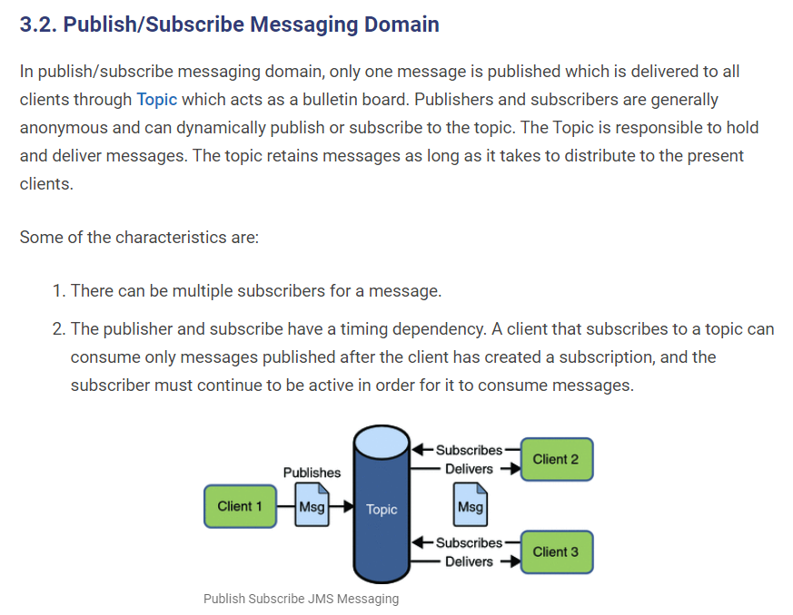

# spring-boot-jms-activemq-example
tutorials links  
https://receitasdecodigo.com.br/spring-boot/exemplo-de-projeto-com-spring-boot-jms-activemq-usando-filas-e-topicos

https://howtodoinjava.com/jms/jms-java-message-service-tutorial/

https://www.tomitribe.com/blog/5-minutes-or-less-activemq-with-jms-queues-and-topics/

https://www.youtube.com/watch?v=npxiy45CPuM   

### JMS   
Java Message Service é uma especificação padronizada para programas Java distribuídos, para comunicação direta.
É uma API da linguagem Java para middleware orientado a mensagens. Através da API JML duas ou mais aplicações podem se comunicar por mensagens.

Middleware é o software que se encontra entre o sistema operacional e os aplicativos nele executados. Funcionando de forma essencial como uma camada oculta de tradução, o middleware permite a comunicação e o gerenciamento de dados para aplicativos distribuídos.  

JMS é assincrono, ou seja, o produtor (Client) que envia uma mensagem não requer uma resposta, ele simplesmente envia ao servidor (Broker) e esquece, assim que o destinatário (Consumer) estiver disponível ele consome a mensagem na fila ou topico.

Para executar é preciso que o provedor esteja ativo no server, como por exemplo o ActiveMQ, indo na pasta bin/win64/activemq.bat. Pode ser iniciado o activeMQ e a partir dai os serviços conseguem enviar e receber as mensagens através dele.

Executar o activeMQ
Baixar a ultima versão, descompactar e ir em C:\ws-developer\jms\ActiveMQ\apache-activemq-5.16.3\bin\win64 duplo click em activemq.bat
Sobe na porta http://localhost:8161/admin/ user admin senha admin

### Tipos de programas ou componentes Java usados no JMS  
Cliente - Produz ou consome mensagens  
Produtor - Apenas produz as mensagens  
Consumidor -  Recebe e consome as mensagens  
Provedor - Qualquer um dos vários sistemas que implementem as especificações JMS.  
Destino - Um objeto que suporta comunicação indireta no JMS, ou um tópico JMS ou uma fila JMS.  

### Modelos suportados
Ponto a ponto ou modelo de filas (Queue)  
Publish/Subscribe (Topics)  
Em ambos os modelos não é necessário que o produtor e consumidor estejam em execução ao mesmo tempo, porque o provedor (Broker - ActiveMQ no exemplo) recebe e direciona as mensagens.  

### p2p
No modelo ponto a ponto existe um consumidor e um ou mais produtores, e estes produtores conhecem o consumidor e enviam mensagem direto para a fila do consumidor.  
  

### Pub/Sub  
No modelo publish/subscribe as mensagens são publicadas pelos produtores (Publishers) contendo um Topico, e os consumidores (subscribers) podem registrar interesse em receber mensagens de determinados topicos, assim quando a mensagem é enviada, todos os consumidores que tem registro de interesse recebem essa mensagem. Nem o produtor (publisher) e o consumidor (subscriber) sabem um do outro, conhecem apenas os topicos.  
  

# Nomenclaturas
POJO - Plain Old Java Object  
JMS - Java Message Service

